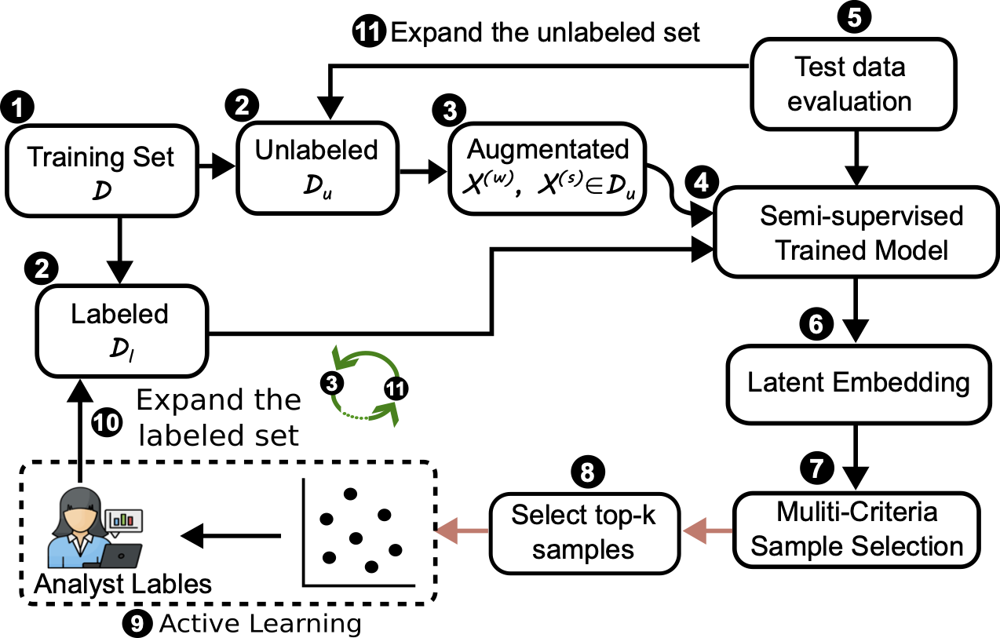

<!-- # Self-supervised active learning with coreset based replay for Malware Detection

In this research, we propose semi-supervised active learning framework that integrates uncertainty-based coreset replay with self-supervised loss functions to achieve robust concept drift detection and adaptation in malware classification.

-->

# CITADEL: A Semi-Supervised Active Learning Framework for Malware Detection Under Continuous Distribution Drift

CITADEL is a semi-supervised active learning framework for Android malware detection designed to handle **long-term concept drift**.  
It integrates:
- Malware domain–focused binary feature augmentations
- FixMatch-based semi-supervised learning
- Prioritized multi-criteria active sample selection
- Enhanced objective function for separating boundary samples.
to adapt to malware concept drift.

The following figure shows the high-level pipeline of **CITADEL**:

<p align="center">
  
</p>


## Requirements & Installation

After downloading the datasets and cloning the CITADEL repository, set up the environment using **Conda**:

```bash
conda env create -f env.yml
conda activate citadel-env
```

### Hardware Requirements
- CUDA-supported GPU (≥ 32 GB memory recommended)
- System RAM (≥ 32 GB)

We implemented and evaluated CITADEL on a dedicated research server equipped with:
- 4 x NVIDIA H100 NVL GPU
- 1.0 TB RAM

We also successfully ran experiments on **Google Colab Pro**

### Software Requirements
- Python 3.10
- PyTorch ≥ 2.0 with CUDA toolkit
- NumPy, Pandas, Matplotlib, SciPy
- scikit-learn, tqdm, tensorboard

All dependencies are specified in: `environment.yml` (Conda)


## Datasets

We evaluate on three Android malware datasets:

- APIGraph (2012–2018)
- Chen-AndroZoo (2019–2021)
- LAMDA (2013–2025)

Please follow the steps below to download and preprocess them:

For APIGraph and Chen-AndroZoo, For APIGraph and Chen-AndroZoo, we use the datasets provided in the paper "Continuous Learning for Android Malware Detection", which are available through their official [active-learning](https://github.com/wagner-group/active-learning).  

### Download APIGraph (2012–2018) and Chen-AZ (2019-2021) dataset
- Download the datasets [here](https://drive.google.com/file/d/1O0upEcTolGyyvasCPkZFY86FNclk29XO/view?usp=drive_link) provided by the [active-learning](https://github.com/wagner-group/active-learning) repository.
- Extract the downloaded zip into the `data/` directory:  `data/gen_apigraph_drebin` and `data/gen_androzoo_drebin`

### Download LAMDA (2013-2025) dataset
The **LAMDA** dataset (2013–2025) is provided by [IQSeC-Lab](https://github.com/IQSeC-Lab/LAMDA) and hosted on Hugging Face.

#### Download Instructions:

To automatically download and preprocess the dataset, run the following command:

```bash
python download_LAMDA.py
```
This script will download the LAMDA baseline which is a Drebin feature-based Android malware dataset (in .npz format) then, split the .npz files into month-wise subsets.

The resulting directory structure will be automatically organized under:

LAMDA_dataset/
├── NPZ_Version/
│   ├── npz_Baseline/
│   └── npz_Baseline_MonthWise/


## Running CITADEL

CITADEL integrates:
- **Custom Augmentation**: e.g., `random_bit_flip_bernoulli`  
- **CITADEL Objective Function**: FixMatch + supervised contrastive loss  
- **Active Learning**: Multi-criteria sample selector (uncertainty, boundary, low-confident)  

To run **CITADEL** on all three Android malware benchmark datasets (**API-Graph, Chen-AndroZoo, LAMDA**) with a labeling budget of **400**, use:

```bash
./CITADEL/run_citadel.sh
```

#### Example: Running CITADEL with Active Learning on API-Graph for 400 labeling budget

```bash
## Script to run CITADEL with active learning on the API-Graph dataset
DATASET="apigraph"
DATA_DIR="/home/mhaque3/myDir/data/gen_apigraph_drebin/"
UC='priority'
BUDGET=400
AUG="random_bit_flip_bernoulli"
SEED=220
LR=0.03
EPOCHS=200
RETRAIN_EPOCHS=70
BATCH_SIZE=512
AL_BATCH_SIZE=512

AL_START_YEAR=2013
AL_START_MONTH=7
AL_END_YEAR=2018
AL_END_MONTH=12

strategy="CITADEL"
LABEL_RATIO=0.4
LAMBDA_SUPCON=0.5
TS=$(date "+%m.%d-%H.%M.%S")

SAVE_PATH="CITADEL_results"
mkdir -p $SAVE_PATH

CUDA_VISIBLE_DEVICES=1 nohup python -u CITADEL/citadel_fixmatch_al.py \
    --dataset $DATASET --data_dir $DATA_DIR \
    --lr $LR \
    --epochs $EPOCHS --retrain_epochs $RETRAIN_EPOCHS \
    --labeled_ratio $LABEL_RATIO \
    --lambda_supcon $LAMBDA_SUPCON \
    --batch_size $BATCH_SIZE \
    --al_batch_size $AL_BATCH_SIZE \
    --al_start_year $AL_START_YEAR --al_start_month $AL_START_MONTH \
    --al_end_year $AL_END_YEAR --al_end_month $AL_END_MONTH \
    --al \
    --supcon \
    --unc_samp $UC \
    --budget $BUDGET \
    --aug $AUG \
    --seed $SEED \
    --strategy $strategy \
    --save_path $SAVE_PATH > $SAVE_PATH/citadel_w_al_${DATASET}_${UC}_${AUG}_${BUDGET}_seed_${SEED}_${TS}.log 2>&1 &

```


Please make sure that we provide the correct dataset argument name with appropriate directory. The above command will also work on LAMDA dataset by changing the argument dataset name and directory. 


The output results will be saved in both a CSV file and a log file inside the CITADEL_results directory.

- The CSV file contains detailed scores for each evaluation month, where each row represents the test performance for a specific month.

- The log file includes the full training and evaluation logs. At the end of the log, you can find the average performance of CITADEL across all months, including mean F1 score, False Negative Rate (FNR), and False Positive Rate (FPR).

You can also use the CSV file to manually compute or verify the average F1 score, FNR, and FPR across all test months.


### Key Arguments
| Argument           | Description                                                              |
| ------------------ | ------------------------------------------------------------------------ |
| `--dataset`        | Dataset name (`APIGraph`, `AndroZoo`, `LAMDA`)                           |
| `--data_dir`       | Path to dataset directory                                                |
| `--epochs`         | Number of training epochs                                                |
| `--retrain_epochs` | Number of retraining epochs for each active learning cycle               |
| `--batch_size`     | Training batch size                                                      |
| `--al_batch_size`  | Active learning retraining batch size                                    |
| `--lr`             | Learning rate                                                            |
| `--labeled_ratio`  | Fraction of labeled data used initially                                  |
| `--lambda_supcon`  | Weight for supervised contrastive loss                                   |
| `--al_start_year`  | Start year for testing (e.g., 2013)                                      |
| `--al_start_month` | Start month for testing (e.g., 7 for July)                               |
| `--al_end_year`    | End year for testing (e.g., 2018)                                        |
| `--al_end_month`   | End month for testing (e.g., 12 for December)                            |
| `--al`             | Enable Active Learning (default: False)                                  |
| `--supcon`         | Enable supervised contrastive loss                                       |
| `--strategy`       | Learning strategy (`CITADEL`, baseline variants)                         |
| `--unc_samp`       | Uncertainty sampling method (`lp-norm`, `boundary`, `priority`)          |
| `--budget`         | Number of samples to label per round in active learning                  |
| `--aug`            | Augmentation type (e.g., `random_bit_flip`, `random_bit_flip_bernoulli`) |
| `--seed`           | Random seed for reproducibility                                          |
| `--save_path`      | Path to save results and logs                                            |


To run CITADEL on Chen-AndroZoo:
The **Chen-AndroZoo** dataset contains **16k+ features**, which increases memory requirements.  
To ensure stable training, we recommend reducing the **batch size** to `128` and the **learning rate** to `0.003`. Change the following arguments to run on Chen-AndroZoo dataset.


```bash
DATASET="chen-androzoo"
DATA_DIR="/home/mhaque3/myDir/data/gen_androzoo_drebin/"
LR=0.003
BATCH_SIZE=128
AL_BATCH_SIZE=128

AL_START_YEAR=2020
AL_START_MONTH=7
AL_END_YEAR=2021
AL_END_MONTH=12
```

To run CITADEL on LAMDA, change the following arguments.


```bash
DATASET="lamda"
DATA_DIR="./LAMDA_dataset/NPZ_Version/npz_Baseline"
LR=0.03
BATCH_SIZE=512
AL_BATCH_SIZE=512

AL_START_YEAR=2014
AL_START_MONTH=7
AL_END_YEAR=2025
AL_END_MONTH=1
```

---

## Table II – CITADEL Performance (without Active Learning)

To reproduce **Table II** (baseline CITADEL without Active Learning), run the following command:

```bash
./CITADEL/run_citadel_baseline.sh

```


## Acknowledgements

- We thank the authors of the paper "Continuous Learning for Android Malware Detection" and their GitHub repository [Chen-AL](https://github.com/wagner-group/active-learning) for providing the processed datasets (**APIGraph 2012–2018** and **AndroZoo 2019–2021**).  
- Special thanks to the collaborators and my supervisor Dr. Mohammad Saidur Rahman for their guidance and support.  
